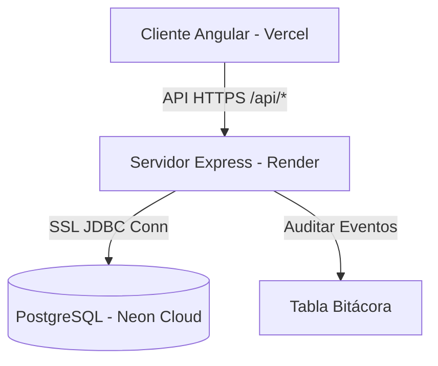

# Manual Técnico - Sistema de Administración, Seguridad y Auditoría (AEGIS Wiki)

Este manual detalla la arquitectura, el diseño de la base de datos, los endpoints de la API, las políticas de seguridad y el sistema de auditoría implementados para cumplir con los requerimientos técnicos de las **Prácticas 11 y 12**.

---

## 1. Arquitectura General del Sistema

El sistema sigue una arquitectura desacoplada cliente-servidor (SPA + API REST):

*   **Frontend**: Angular 21 (SPA) con componentes standalone y signals para reactividad. Utiliza PrimeNG como biblioteca de componentes de UI.
*   **Backend**: Node.js con Express, arquitectura REST y pool de conexiones PostgreSQL.
*   **Base de Datos**: PostgreSQL 17 hospedado en la nube mediante **Neon**, con cifrado SSL obligatorio y conexión pooled.
*   **Servidor Backend**: Desplegado en **Render** dentro de un contenedor Docker automatizado.
*   **Servidor Frontend**: Desplegado en **Vercel** con reescritura de API dinámica (`vercel.json`).



---

## 2. Estructura de la Base de Datos

Las tablas involucradas en el control de acceso, seguridad y auditoría son:

### 2.1 Tabla: `usuarios`
Almacena las cuentas de usuario y los estados de bloqueo/seguridad:
```sql
CREATE TABLE IF NOT EXISTS usuarios (
  id SERIAL PRIMARY KEY,
  nombre VARCHAR(80) NOT NULL,
  email VARCHAR(120) UNIQUE NOT NULL,
  role VARCHAR(16) NOT NULL DEFAULT 'user' CHECK (role IN ('admin', 'user')),
  password_hash TEXT NOT NULL,
  activo BOOLEAN NOT NULL DEFAULT TRUE,                -- Para eliminación lógica y desactivación
  intentos_fallidos INT NOT NULL DEFAULT 0,            -- Contador de fuerza bruta
  bloqueado_hasta TIMESTAMP DEFAULT NULL,              -- Marca temporal de bloqueo lockout
  permisos TEXT[] NOT NULL DEFAULT '{}',               -- Privilegios detallados (ACL)
  created_at TIMESTAMP NOT NULL DEFAULT NOW()
);
```

### 2.2 Tabla: `bitacora` (Auditoría)
Registra las acciones clave de forma inmutable:
```sql
CREATE TABLE IF NOT EXISTS bitacora (
  id SERIAL PRIMARY KEY,
  usuario VARCHAR(120) NOT NULL,                       -- Correo del usuario que realizó la acción
  fecha DATE NOT NULL DEFAULT CURRENT_DATE,            -- Fecha del evento
  hora TIME NOT NULL DEFAULT CURRENT_TIME,            -- Hora del evento
  ip_address VARCHAR(45) NOT NULL,                     -- IP origen (IPv4 o IPv6 adaptada)
  accion VARCHAR(255) NOT NULL                         -- Detalle del evento ejecutado
);
```

---

## 3. Políticas y Controles de Seguridad Implementados

El sistema cuenta con los siguientes controles de seguridad activa:

1.  **Cifrado Hash de Contraseñas**: Las claves se encriptan de manera unidireccional en el backend usando la biblioteca `bcrypt` con un costo de cómputo de 10 salt rounds (`bcrypt.hash(password, 10)`).
2.  **Políticas de Contraseña Segura (Fuerza de Claves)**: Las contraseñas se evalúan con una expresión regular para verificar que cumplan con una longitud mínima de 8 caracteres, al menos una letra mayúscula, una minúscula, un número y un carácter especial.
3.  **Bloqueo de Cuenta por Fuerza Bruta (Lockout)**: Si un usuario acumula 3 intentos fallidos de inicio de sesión de forma consecutiva, la columna `bloqueado_hasta` se establece a `NOW() + 15 minutos`. El servidor deniega todas las peticiones posteriores hasta que se cumpla el plazo, reiniciando el contador al ingresar con éxito.
4.  **Baja Lógica (Soft Delete)**: Las cuentas eliminadas por el administrador no se borran físicamente mediante `DELETE` (lo cual provocaría huérfanos en auditoría). En su lugar, se actualiza la columna `activo` a `false` (`UPDATE usuarios SET activo = false`).
5.  **Expiración de Sesión Local**: El frontend almacena la sesión localmente y la hace expirar de forma transparente tras 30 minutos de inactividad, forzando un cierre de sesión.

---

## 4. Endpoints de la API (REST)

### 4.1 Endpoints de Autenticación y Perfil
*   `POST /auth/register`: Registro de usuario aplicando políticas de contraseña.
*   `POST /auth/login`: Validación de credenciales, control de bloqueo e inicio de sesión.
*   `POST /auth/logout`: Registra la salida en la bitácora de auditoría.
*   `PUT /auth/profile`: Edición del nombre del usuario de la sesión actual (auditable).
*   `PUT /auth/password`: Cambio de contraseña propia validando clave anterior y fortaleza de la nueva (auditable).

### 4.2 Endpoints de Administración (`x-user-role: admin` requerido)
*   `GET /admin/usuarios`: Listar cuentas y permisos de todos los usuarios.
*   `POST /admin/usuarios`: Crear un usuario asignando roles y permisos (cifra clave).
*   `PUT /admin/usuarios/:id`: Actualizar datos, roles, permisos y estado activo de un usuario.
*   `PUT /admin/usuarios/:id/password`: Reestablecer la clave de un usuario desde la administración.
*   `DELETE /admin/usuarios/:id`: Desactivación lógica (baja) del usuario.
*   `GET /admin/bitacora`: Obtener los últimos 100 registros de la bitácora de auditoría.
