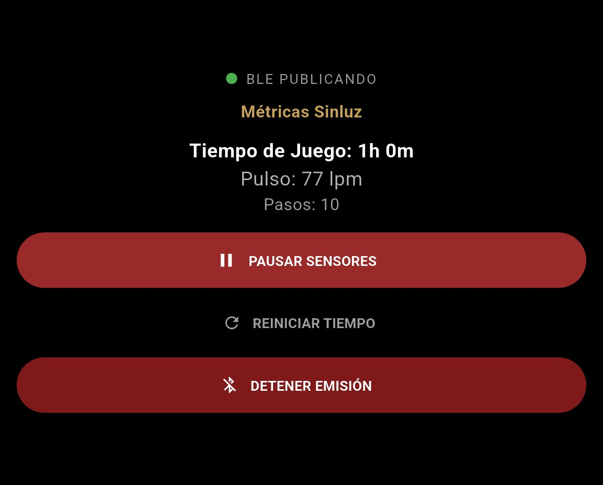
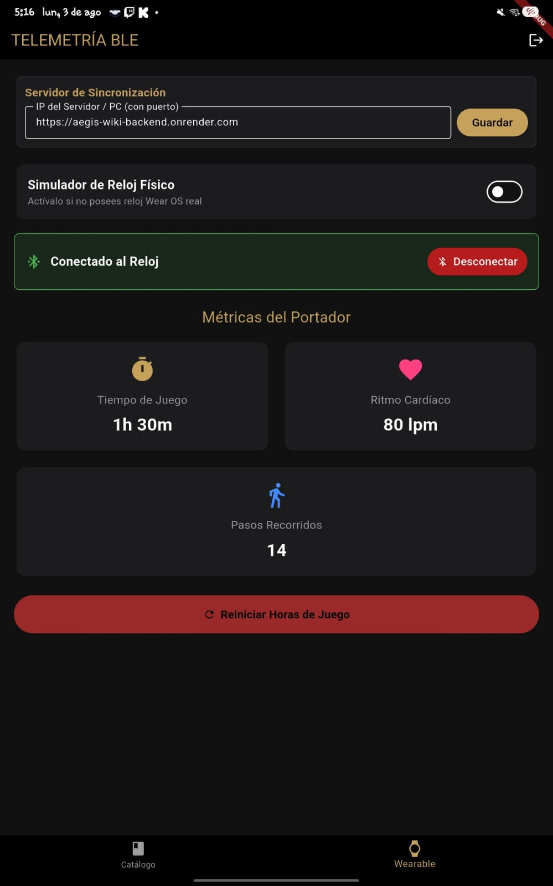
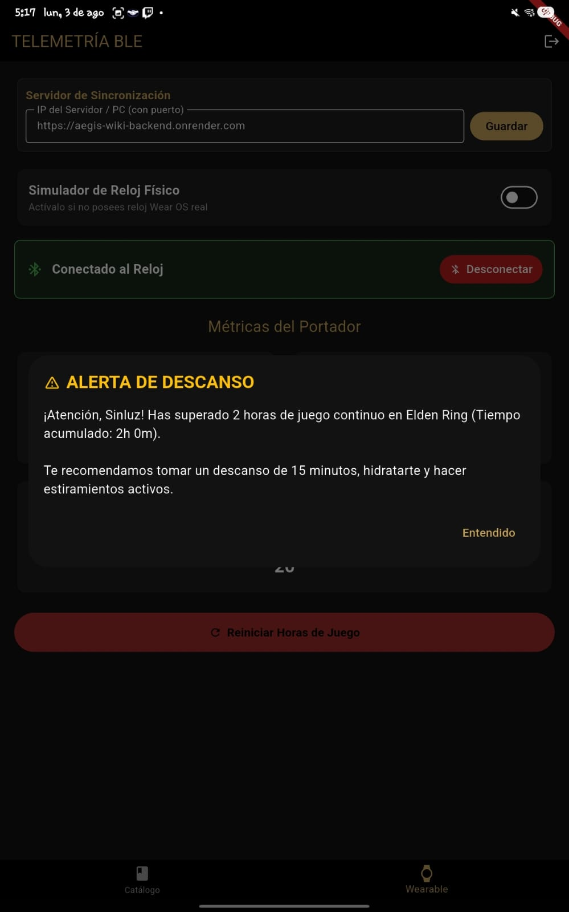
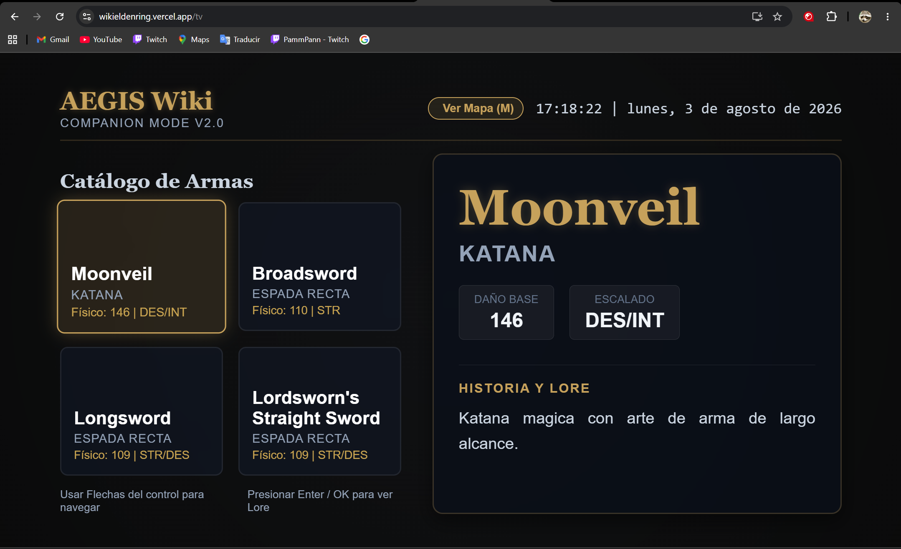
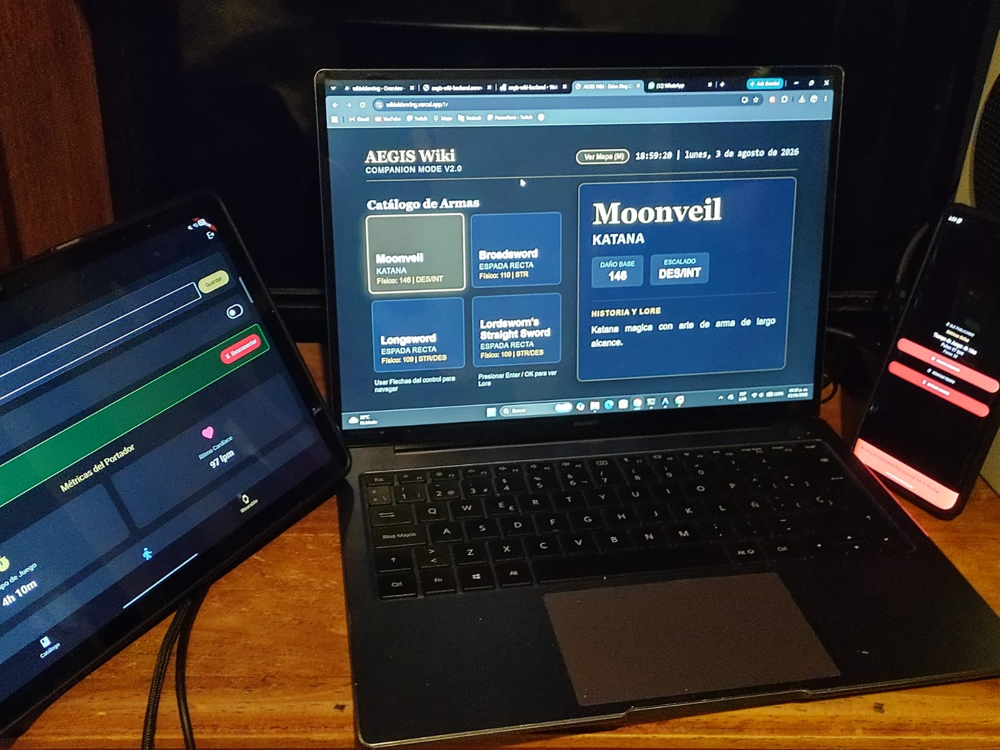

# Reporte de Configuración de Herramientas, Emuladores y Plan de Pruebas (SA.5 y SA.6)

Este reporte contiene la documentación técnica de las herramientas, emuladores y el plan de pruebas ejecutado para validar el ecosistema de la **Evaluación 2 (Nivel SA - Satisfactorio)**.

---

## 1. SA.6.A: Configuración de Herramientas de Desarrollo

### 1.1 Versiones del SDK de Flutter y Dart
*   **Flutter SDK**: 3.44.4 (Canal stable)
*   **Dart SDK**: 3.12.2
*   **Versión del Framework de Flutter**: ad70ec4617 (revisión de hace 3 semanas)

### 1.2 Android Studio y Plugins
*   **IDE**: Android Studio Ladybug (2024.2.1)
*   **Plugins Instalados**:
    *   *Flutter Plugin*: v78.2.1 (habilita la creación de proyectos y ejecución en emuladores).
    *   *Dart Plugin*: v241.15989 (soporte de sintaxis y tipado).

### 1.3 Herramientas de la Unidad 3 (Smart TV)
*   **IDE Principal**: Visual Studio Code (v1.91.0)
*   **Extensiones VS Code**:
    *   *Angular Language Service*: v18.0.0 (autocompletado de plantillas HTML y enlace de datos).
    *   *Prettier - Code Formatter*: v10.4.0 (formateo homogéneo de CSS, HTML y TS).
*   **FFmpeg**: v6.1 (usado localmente para optimizar videos de la Smart TV y comprimir las animaciones de fondo).

### 1.4 Dependencias Clave de las Aplicaciones
Las dependencias y versiones configuradas en los archivos `pubspec.yaml` son:
*   **telefono_app**:
    *   `flutter_blue_plus: ^2.3.10` (gestión del escaneo y conexión BLE).
    *   `http: ^1.6.0` (peticiones REST al servidor Express).
    *   `provider: ^6.1.5+1` (gestión de estado de telemetría y sesión).
    *   `shared_preferences: ^2.5.5` (persistencia del token JWT).
*   **wearable_app**:
    *   `flutter_ble_peripheral: ^2.1.1` (servidor GATT y publicidad BLE).

---

## 2. SA.6.B: Configuración de Dispositivos Físicos y Entorno

En lugar de emuladores, esta entrega utiliza dispositivos físicos reales para garantizar el comportamiento real de los sensores y la comunicación BLE.

### 2.1 Dispositivo Móvil Físico
*   **Modelo**: Samsung Galaxy Tab A8 (SM-X210)
*   **Versión del Sistema**: Android 16 (API 36)
*   **Memoria RAM**: 4 GB RAM
*   **Conectividad**: Wi-Fi local (802.11ac) y Bluetooth Low Energy (BLE 5.0).

### 2.2 Dispositivo Wearable / Emisor BLE Físico
*   **Modelo**: Motorola Edge 60 Pro (Actuando como emisor simulador del wearable)
*   **Versión del Sistema**: Android 16 (API 36)
*   **Memoria RAM**: 12 GB RAM
*   **Conectividad**: Bluetooth Low Energy (BLE 5.2, modo Peripheral GATT).

### 2.3 Simulación de Smart TV (Chrome DevTools)
*   **Navegador**: Google Chrome (v126.0)
*   **Resolución Configurada**: Fija en `1920px x 1080px` (Full HD) mediante emulación de dispositivo personalizada en DevTools.
*   **User Agent Simulado**: `Mozilla/5.0 (Linux; GoogleTV; Chromecast) AppleWebKit/537.36 (KHTML, like Gecko) Chrome/126.0.0.0 Safari/537.36` (Chrome on Android TV)
*   **Safe Zone**: Margen activo de seguridad del 5% (`padding: 54px 96px`).
*   **Navegación**: Mapeada a la entrada física de teclado que simula el D-pad físico de la televisión.

### 2.4 Tabla de Troubleshooting (Solución de problemas reales en dispositivos físicos)
| Problema Encontrado | Causa Raíz | Solución Aplicada |
| :--- | :--- | :--- |
| **Error de permisos BLE en Android 12+** | API 31+ requiere permisos explícitos de `BLUETOOTH_CONNECT`, `BLUETOOTH_SCAN` y `BLUETOOTH_ADVERTISE` en tiempo de ejecución. | Se añadieron las etiquetas de permisos correspondientes en los `AndroidManifest.xml` de ambas aplicaciones. |
| **Crasheo de red local (SocketException)** | Android bloquea por defecto las peticiones HTTP claras (sin cifrar) a servidores de desarrollo locales (`http://192.168.1.XX`). | Se configuró `android:usesCleartextTraffic="true"` en el `<application>` de la app móvil. |
| **Petición rechazada o timeout a IP local** | La conexión a `10.0.2.2` no es válida en hardware físico, y las IPs locales pueden cambiar según la red Wi-Fi. | Se añadió un panel interactivo de IP dinámica en la interfaz de la App móvil (Dashboard/Login) para cambiar el host local sin recompilar. |
| **Pérdida de paquetes de telemetría local** | El cortafuegos de Windows o la red móvil del teléfono pueden bloquear el tráfico de loopback local. | Se desactivaron de manera temporal los datos móviles en el celular para forzar el enrutamiento exclusivo por la red local Wi-Fi. |

---

## 3. SA.5: Plan y Reporte de Pruebas (10 Casos de Verificación)

| ID Caso | Componente | Descripción de la Prueba | Resultado Esperado | Estado (P/F) |
| :--- | :--- | :--- | :--- | :--- |
| **TC-01** | API Backend | Consumo de datos reales del catálogo de armas mediante `/api/armas`. | El servidor responde un JSON con el catálogo de armas de Elden Ring. | **PASS** |
| **TC-02** | Teléfono | Inicio de sesión seguro con JWT contra la base de datos de Express. | El usuario inicia sesión y se almacena el token JWT de forma segura. | **PASS** |
| **TC-03** | Teléfono | Manejo de error de red si el backend principal en Render no responde. | La app activa el fallback automático a `localhost:3000` sin crashear. | **PASS** |
| **TC-04** | Wearable | Emisión de datos dinámicos (pasos, ritmo y tiempo de juego) vía notificaciones BLE. | El reloj transmite payloads optimizados de bytes (pasos, pulso cardíaco y contador de tiempo de juego). | **PASS** |
| **TC-05** | Teléfono | Recepción y parseo de bytes de notificaciones BLE del reloj. | La app móvil se suscribe con `setNotifyValue(true)` y muestra el tiempo de juego, pasos y ritmo. | **PASS** |
| **TC-06** | Ecosistema | Alerta médica y recordatorio de tiempo de juego excesivo con vibraciones. | Se despliega un modal de descanso en el teléfono y vibraciones físicas en el wearable al alcanzar las 2 horas de juego (simulado). | **PASS** |
| **TC-07** | Smart TV | Navegación D-pad mediante flechas del teclado físico en el catálogo. | El foco dorado se desplaza en el grid 2x2 sin romper la lógica de límites. | **PASS** |
| **TC-08** | Smart TV | Tecla Enter/OK en la TV para cargar detalles y recurso multimedia. | Al presionar Enter, se despliega la descripción, estadísticas e imagen de fondo. | **PASS** |
| **TC-09** | PWA Smart TV | Comportamiento offline mediante Service Worker. | Tras desactivar la red en Chrome, la estructura y página de la TV cargan de caché. | **PASS** |
| **TC-10** | Ecosistema | Sincronización en tiempo real Teléfono -> TV (Companion Mode). | Al tocar un arma en el móvil, la Smart TV se actualiza en menos de 1 segundo. | **PASS** |

---

## 4. SA.6.A: Pasos de Instalación y Replicación del Entorno (Reproducibilidad)

Cualquier alumno puede replicar este entorno de desarrollo siguiendo estos pasos detallados:

### Paso 1: Requisitos de Software
1.  **Instalar Node.js**: Descargar e instalar la versión **v24.13.0+** (que incluye `npm`).
2.  **Instalar Flutter & Dart SDK**: Descargar la versión de Flutter **3.44.x** (canal estable) y agregar las rutas `/bin` del SDK a las Variables de Entorno del sistema.
3.  **Instalar Android Studio**: Configurar Android Studio Ladybug (2024.2.1) e instalar los plugins de **Flutter** y **Dart** desde *Settings -> Plugins*.
4.  **Descargar ffmpeg**: Instalar `ffmpeg` y añadirlo a la variable PATH del sistema.

### Paso 2: Configuración del Servidor Backend
1.  Navegar a la carpeta del backend: `cd mi-servidor`.
2.  Instalar dependencias: `npm install`.
3.  Copiar el archivo de entorno: `cp .env.example .env` y editar las variables de la base de datos (PostgreSQL/Neon URL).
4.  Inicializar la base de datos local: `npm run db:init` (para cargar las tablas y datos semilla de Elden Ring).
5.  Iniciar el servidor: `npm start` (correrá en `http://localhost:3000`).

### Paso 3: Configuración de la Smart TV PWA
1.  Navegar a la carpeta del frontend: `cd frontend`.
2.  Instalar dependencias: `npm install`.
3.  Ejecutar el servidor local con proxy: `npm start` (ejecutará `ng serve --proxy-config proxy.conf.json` en `http://localhost:4200`).
4.  Abrir la TV en el navegador: Abrir `http://localhost:4200/tv`. Presionar `F12`, activar la vista responsiva en DevTools y definir una resolución fija de `1920x1080`.

### Paso 4: Preparación de la App Móvil (Teléfono Físico)
1.  Conectar el teléfono Android a la PC mediante cable USB.
2.  Habilitar **Opciones de desarrollador** y **Depuración USB** en los ajustes del teléfono.
3.  Navegar a la carpeta: `cd telefono_app`.
4.  Descargar dependencias de Flutter: `flutter pub get`.
5.  Compilar e instalar la app en el teléfono: `flutter run` (asegúrate de que reconozca tu dispositivo físico).
6.  *Nota de Conexión Wi-Fi*: Asegúrate de que el teléfono y la PC estén en la misma red Wi-Fi. Abre la app en el teléfono e ingresa la dirección IP de tu computadora (ej: `http://192.168.1.15:3000`) en el panel de configuración de la pantalla de inicio o del Dashboard.

### Paso 5: Preparación de la App Wearable (Wear OS Físico)
1.  En tu reloj Wear OS, ve a *Ajustes -> Sistema -> Acerca de -> Información de software* y presiona **Número de compilación** 7 veces para activar las Opciones de Desarrollador.
2.  En *Ajustes -> Opciones de desarrollador*, activa **Depuración ADB** y **Depuración inalámbrica**.
3.  Anota la dirección IP del reloj y el puerto que muestra la depuración inalámbrica.
4.  Desde la terminal de tu PC, conéctate al reloj mediante ADB:
    `adb connect <IP_del_reloj>:<Puerto>`
5.  Confirma la conexión en la pantalla de tu reloj.
6.  Navegar a la carpeta: `cd wearable_app`.
7.  Descargar dependencias: `flutter pub get`.
8.  Compilar e instalar en el reloj: `flutter run -d <ID_del_reloj_obtenido_con_adb_devices>`.

---

## 5. SA.5 & SA.6.B: Evidencia Visual (Dispositivos Físicos)

A continuación, se listan los marcadores para incluir las capturas físicas exigidas por la rúbrica como evidencia del ecosistema funcionando simultáneamente. 

> [!IMPORTANT]
> **Nota para el Alumno**: Guarda las fotos y capturas reales de tus dispositivos en la carpeta `assets/evidence/` de tu proyecto con los nombres indicados abajo para que se muestren correctamente en este reporte.

### 5.1 Capturas del Wearable (Reloj Wear OS)
*Muestra la interfaz del reloj físico con los sensores encendidos y transmitiendo.*

### 5.2 Capturas del Teléfono (Recepción de Datos)
*Muestra la pantalla de tu celular con las métricas actualizándose por Bluetooth en tiempo real.*

### 5.3 Captura de Alerta Médica de Descanso
*Muestra la alerta visible en el teléfono cuando el tiempo de juego acumulado supera las 2 horas.*

### 5.4 Capturas de la Smart TV PWA
*Muestra la vista de 1920x1080 del navegador de tu PC en Companion Mode con el grid de 2x2 mostrando las especificaciones (3 campos).*

### 5.5 Captura del Ecosistema Integrado Completo
*Fotografía real que muestra los 3 dispositivos (Reloj, Teléfono e Interfaz de TV en la pantalla) funcionando simultáneamente.*

---

## 6. Firma de Validación
*   **Nombre del Alumno**: Santiago Alberto Martínez Hernández
*   **Grupo**: IDGS16
*   **Fecha de Ejecución**: 4 de Agosto de 2026
*   **Firma**: *Validado académicamente bajo el ecosistema AEGIS Wiki.*

